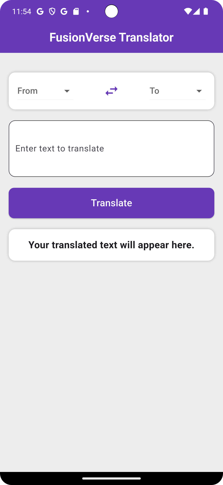
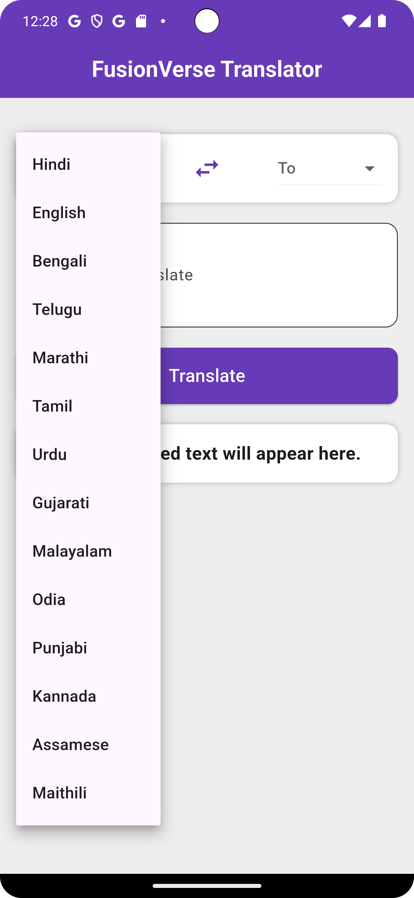

# 🚀 FusionVerse Translator 🌍🎙️  

A powerful and efficient **multi-language translator app** built with Flutter, featuring **speech-to-text** and **Provider state management** for seamless performance.  

## ✨ Features  
- 🔹 **Supports 14 Indian languages** 🌐 
- 🎙 **Text-to-Speech integration** 
- 🖌 **Clean and modern UI**  
- ⚡ **Optimized performance using Provider**  

## 📸 Screenshots  
            

## 📌 Supported Languages  
✅ Hindi  
✅ English  
✅ Bengali  
✅ Telugu  
✅ Marathi  
✅ Tamil  
✅ Urdu  
✅ Gujarati  
✅ Malayalam  
✅ Odia  
✅ Punjabi  
✅ Kannada  
✅ Assamese  
✅ Maithili  

## 🛠️ Tech Stack  
- **Flutter** for cross-platform development  
- **Provider** for state management  
- **Google Translate API** 
- **Text-to-Speech API**

## 🚀 Getting Started  

### Prerequisites  
- Install **Flutter SDK**  
- Set up **Android Studio / VS Code**  

### Installation  
1. Clone the repo:  
   ```bash
   git clone https://github.com/abhi96088/FusionVerse.git
   cd FusionVerse
